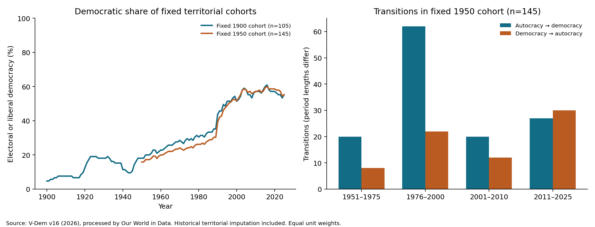

# Political Science: Long-Run Democratization and Authoritarian Stability

Research on whether democratic gains persist across long historical periods, and what could prevent authoritarian systems from renewing themselves indefinitely. The project combines historical regime data, a review of political-science research, and conditional mathematical models checked in Lean 4.

The central empirical finding is a substantial long-run increase in democracy within the historical samples examined, alongside democratic reversals and recent net losses. The formal models identify conditions under which an authoritarian arrangement cannot continue indefinitely. Connecting those conditions to the observed historical trend remains an open empirical question.

## Read the papers

Start with **Long-Run Democratization under Reversal**, which brings together the historical findings and the formal conditions for authoritarian exit.

| Paper | What it covers |
| --- | --- |
| [Long-Run Democratization under Reversal](Long_Run_Democratization.md) · [PDF](Long_Run_Democratization.pdf) | The main working paper: fixed-cohort evidence, classification and coverage checks, and formal conditions for authoritarian exit. |
| [Testing the Long-Run Democratization Hypothesis](Empirical_Democratization_Test.md) | The empirical analysis: data definitions, transition accounting, matched-country comparisons, uncertainty, and limitations. |
| [Can Autocracy Be Proved Unstable over a Sufficiently Long Horizon?](Autocracy_Stability_Research.md) | The broader research report: literature, renewal constraints, incentives, expertise, peaceful mobilization, counterexamples, and unresolved assumptions. |

The [formal project README](autocracy_stability/README.md) provides a module-by-module guide and details of the verification process.

## Historical findings

The analysis tracks entry into and exit from democracy. Replacing one authoritarian ruler or regime with another contributes no democratic gain. A democratic transition followed by a reversal cancels in the net total.

The primary data are V-Dem v16's Regimes of the World classification, processed by Our World in Data. Electoral and liberal democracies count as democratic. Each comparison below holds its set of territorial units fixed through 2025 and requires observations in every intervening year.

| Period | Fixed territorial units | Democracies at start | Democracies in 2025 | Change in democratic share |
| --- | ---: | ---: | ---: | ---: |
| 1900–2025 | 105 | 5 (4.8%) | 58 (55.2%) | +50.5 percentage points |
| 1950–2025 | 145 | 23 (15.9%) | 80 (55.2%) | +39.3 percentage points |
| 2010–2025 | 176 | 93 (52.8%) | 87 (49.4%) | −3.4 percentage points |

Cohorts differ between rows; these percentages are not one continuous time series. Units receive equal weight, so the figures do not measure the share of the world's population living in democracy.

For the fixed 1950 cohort, **129 democratizations and 72 reversals produce a net gain of 57 democracies**: `23 + 129 − 72 = 80`. In the same cohort, 2011–2025 records 27 entries and 30 reversals.

The second classification, Bjørnskov–Rode version 7.2, also shows substantial post-1950 gains. On an identical sample of 88 countries, V-Dem records a net gain of 32 democracies and Bjørnskov–Rode records 27. Both classifications show recent net losses, including on matched samples. A stricter liberal-democracy threshold also retains the long-run gain and recent decline.



The working paper additionally reports gains in all 137 qualifying century-long windows and in 177 of 187 qualifying half-century windows, with the remaining ten unchanged. These windows overlap and are not independent replications. The paper's endpoint-only and rolling-window extension code and saved outputs are not included in this checkout; the bundled empirical script reproduces the fixed-cohort analyses and checks described below.

## What the formal models establish

The Lean project contains **149 named results across 18 modules**, including supporting lemmas and counterexamples. Its models examine:

- **Correction and incentives:** when unresolved burdens exceed available capacity, and when repair can preserve continued operation.
- **Participation and cooperation:** when collective participation spreads and when institutional withdrawal removes governing capacity, including cases where coordination fails.
- **Resources and expertise:** how investment, depreciation, coalition obligations, worker choices, recruitment, and reserves constrain renewal.
- **Long-run survival:** when recurring political exposure and conditional exit risk force survival bounds toward zero, allowing succession and changing responses.
- **Limits of inference:** why bounded annual spending alone is insufficient, and how identical finite histories can remain compatible with different infinite-horizon outcomes.

The main working paper focuses on two mechanisms: a persistent workforce-renewal shortfall that exhausts a finite accounting stock, and capacity attrition that requires repeated politically exposed renewal. The latter yields vanishing survival only with additional risk assumptions.

Lean checks deductions from explicit definitions and hypotheses. It does not establish that every real autocracy satisfies those hypotheses. Ending an authoritarian arrangement also does not by itself establish democratization or prevent a later reversal. The historical calculations are separate Python analyses, not Lean-certified statistical estimates.

## Repository contents

| Location | Contents |
| --- | --- |
| Root Markdown papers and PDF | Research reports and the main working paper. |
| [autocracy_stability/AutocracyStability/](autocracy_stability/AutocracyStability/) | Lean definitions, proofs, and counterexamples. |
| [autocracy_stability/empirical/](autocracy_stability/empirical/) | Archived data inputs, analysis script, cohort tables, transition ledger, results, and figure. |
| [autocracy_stability/evidence/](autocracy_stability/evidence/) | Saved build and axiom-audit logs, source hashes, and synthetic model outputs. |

## Reproduce the included analyses

Run the commands below from the repository root. They regenerate saved outputs in the project directories.

### Empirical analysis

With a Python 3 virtual environment activated:

```bash
python3 -m pip install pandas numpy scipy matplotlib openpyxl
python3 autocracy_stability/empirical/analyze.py
```

The script reads the included `regimes.csv` and `br.xlsx`; no new data download is required. It checks unique unit-years, classification codes, complete cohort coverage, one-to-one country-year matching, and exact reconciliation of transitions with endpoint changes. It writes cohort tables, matched-classification results, the transition ledger, `results.json`, and `democratization.png`.

Input source addresses and SHA-256 hashes are recorded in [sources.json](autocracy_stability/empirical/sources.json), with input hashes also retained in [results.json](autocracy_stability/empirical/results.json). The analysis ends in 2025 and excludes the workbook's incomplete 2026 observations.

### Formal verification and synthetic examples

Install Lean with `elan` and make `lake` available on your path. The project pins **Lean 4.22.0** in [lean-toolchain](autocracy_stability/lean-toolchain).

```bash
python3 autocracy_stability/verify.py
python3 autocracy_stability/explore.py
python3 autocracy_stability/long_horizon.py
python3 autocracy_stability/resource_experiments.py
```

Alternatively, set `STABILITY_LAKE` to the path of an existing Lean 4.22.0 `lake` executable. These scripts need no third-party Python packages, and the Lean project uses only the bundled standard library, without Mathlib.

`verify.py` builds the project and audits every named theorem. The saved [verification record](autocracy_stability/evidence/verification.json) reports 149 results, no proof gaps or custom axioms, and permits the standard logical axioms `propext`, `Classical.choice`, and `Quot.sound`. The other scripts generate synthetic illustrations rather than country-level estimates.

## Research status

This is working research. The papers distinguish descriptive historical findings, conditional proofs, and the further evidence needed to connect them. Current territorial selection, reconstructed histories, missing coverage, classification choices, and shared international shocks limit the empirical interpretation. No causal estimate of the proposed renewal mechanism or guarantee of future democratic convergence is established.

The main working paper includes references and an AI-assistance statement. It reports that independent external review has not been performed.
